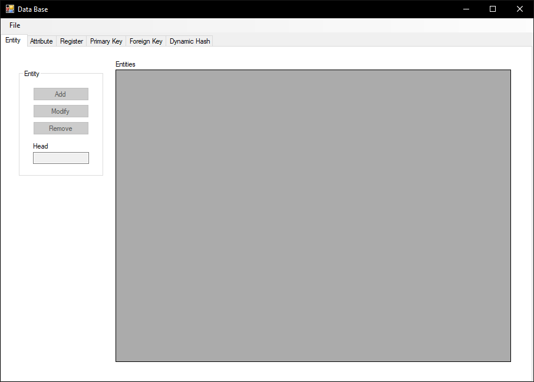
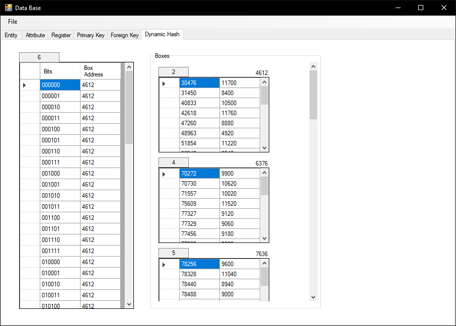

# Simple Database Managing System

Made from scratch, has the minimal functions to work as a DBMS, using C# and WinForms in .NET 4.6.1

## Features

- Add, edit and delete entities
- Add, edit and delete attributes
- Add, edit and delete Register
- Order by primary key, foreign key 
- Order by dynamic hash

Made in class as final proyect, it will have bugs of course.

## Screenshots

